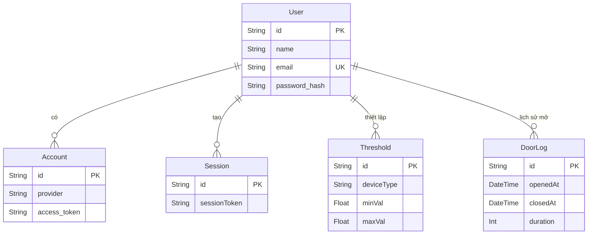

# 1. Design Patterns in SmartHome Project


## 1. Singleton Pattern (Mẫu Khởi tạo duy nhất)
- **Vị trí áp dụng**: `src/lib/prisma.ts`
- **Cách hoạt động**: Pattern này đảm bảo rằng chỉ có **một instance duy nhất** của `PrismaClient` được tạo ra và sử dụng chung trên toàn bộ ứng dụng.
- **Cách dùng trong project**: 
  Trong môi trường phát triển (development) của Next.js với tính năng Hot-Reload, mã nguồn thường xuyên được biên dịch lại. Nếu không dùng Singleton, mỗi lần reload sẽ tạo một kết nối mới tới database (MariaDB), dẫn đến lỗi "Too many connections". Bằng cách lưu trữ instance trong `globalThis`, ứng dụng sẽ tái sử dụng kết nối cũ thay vì tạo mới.

## 2. Provider Pattern (Mẫu Cung cấp - Context API)
- **Vị trí áp dụng**: `src/contexts/SmartHomeContext.tsx`
- **Cách hoạt động**: Sử dụng Context API của React để bao bọc (wrap) các components con, cung cấp một kho trạng thái (state) chung mà không cần phải truyền dữ liệu qua từng lớp component (prop drilling).
- **Cách dùng trong project**: 
  `SmartHomeProvider` bọc toàn bộ các trang nội bộ của ứng dụng (trong `app/(app)/layout.tsx`). Nó quản lý và cung cấp trạng thái của sidebar, danh sách thông báo (notifications), và kết nối dữ liệu MQTT (nhiệt độ, độ ẩm...). Bất kỳ component nào bên trong đều có thể gọi `useSmartHome()` (hoặc `useContext`) để truy cập dữ liệu này ngay lập tức.

## 3. Observer Pattern (Mẫu Quan sát / Pub-Sub)
- **Vị trí áp dụng**: Cơ chế nhận dữ liệu Real-time với MQTT (Adafruit IO)
- **Cách hoạt động**: Một đối tượng (Subject) duy trì danh sách các thành phần phụ thuộc (Observers) và tự động thông báo cho chúng khi có thay đổi trạng thái.
- **Cách dùng trong project**: 
  Dự án đóng vai trò là một **Observer** lắng nghe các kênh (feeds) từ Broker của Adafruit IO. Bất cứ khi nào thiết bị IoT gửi dữ liệu mới lên Broker (Publish), ứng dụng Next.js sẽ nhận được thông báo ngay lập tức thông qua WebSocket và tự động cập nhật lại giao diện (Charts, Cards) mà không cần người dùng phải tải lại trang.

## 4. Adapter Pattern (Mẫu Bộ chuyển đổi)
- **Vị trí áp dụng**: Authentication (NextAuth.js + Prisma) trong `src/lib/auth.ts`
- **Cách hoạt động**: Cho phép các giao diện không tương thích có thể làm việc cùng nhau bằng cách sử dụng một lớp "Adapter" ở giữa.
- **Cách dùng trong project**: 
  Thư viện NextAuth.js cần lưu trữ session và user vào database, nhưng nó không biết bạn đang dùng loại DB nào. Do đó, bạn đã dùng `@prisma/adapter-mariadb` và `@auth/prisma-adapter`. Adapter này làm nhiệm vụ "dịch" các yêu cầu tạo/đọc/cập nhật user của NextAuth thành các câu lệnh Prisma phù hợp với database MariaDB của dự án.

---

## 2. Cấu trúc của dự án (Project Structure)

Dự án được cấu trúc theo mô hình thư mục của **Next.js App Router**, kết hợp với việc tách biệt logic nghiệp vụ và component UI. Dưới đây là kiến trúc thư mục chính:

```text
smart-home/
│
├── app/                            # Thư mục gốc của Next.js App Router
│   ├── layout.tsx                  # Root Layout: Giao diện khung toàn cục (Wrap toàn bộ App)
│   ├── page.tsx                    # Trang chủ (Tự động redirect sang /dashboard)
│   ├── globals.css                 # File CSS toàn cục (Tailwind variables)
│   │
│   ├── (app)/                      # Route group: Các trang ĐƯỢC BẢO VỆ (Protected)
│   │   ├── layout.tsx              # App Shell: Chứa Sidebar, Topbar và SmartHomeProvider
│   │   ├── dashboard/page.tsx      # Bảng điều khiển: Xem cảm biến, đồ thị, nhật ký cửa
│   │   ├── devices/page.tsx        # Quản lý thiết bị: Bật/tắt và thiết lập ngưỡng tự động
│   │   ├── profile/page.tsx        # Trang thông tin và cập nhật cấu hình tài khoản
│   │   ├── notifications/page.tsx  # Hộp thư thông báo (Cảnh báo nhiệt độ, trạng thái...)
│   │   └── settings/page.tsx       # Cài đặt giao diện (Theme) & Đổi mật khẩu
│   │
│   ├── (auth)/                     # Route group: Các trang CÔNG KHAI (Public)
│   │   ├── login/page.tsx          # Trang đăng nhập
│   │   └── register/page.tsx       # Trang đăng ký
│   │
│   └── api/                        # Backend API (Next.js Route Handlers)
│       ├── auth/                   # Xử lý Logic xác thực của NextAuth.js
│       └── user/                   # Các REST API tùy chỉnh (Lấy Profile, Đổi Password)
│
├── components/                     # Các React Components có thể tái sử dụng
│   ├── layout/                     # Sidebar, Topbar...
│   ├── dashboard/                  # Các thẻ hiển thị (StatCard), Đồ thị (Chart)
│   ├── devices/                    # DeviceCard, Thiết lập ngưỡng...
│   └── auth/                       # Form đăng nhập/đăng ký
│
├── src/                            # Thư mục chứa Logic nghiệp vụ (Business Logic)
│   ├── contexts/                   # Quản lý trạng thái toàn cục (SmartHomeContext.tsx)
│   ├── hooks/                      # Custom Hooks (useSensorMQTT.ts)
│   ├── lib/                        # Thư viện tiện ích (prisma.ts, auth.ts)
│   └── types/                      # Định nghĩa kiểu dữ liệu (TypeScript)
│
└── prisma/                         # Cấu hình Database (ORM)
    └── schema.prisma               # Sơ đồ CSDL: User, Threshold, DoorLog
```

---

## 3. Cấu trúc Database (Prisma Schema)

Dự án sử dụng **MariaDB** kết hợp với **Prisma ORM** để định nghĩa và quản lý cơ sở dữ liệu. Lược đồ cơ sở dữ liệu (schema) được chia làm hai phần chính:

### Sơ đồ thực thể kết nối (ER Diagram)


### 3.1. Các bảng phục vụ Xác thực (NextAuth.js)
Để hỗ trợ đăng nhập qua Google OAuth và tài khoản truyền thống (Email/Password), hệ thống có các bảng cơ bản sau:
- **`User` (users)**: Lưu thông tin cơ bản của người dùng như `name`, `email`, `image`, và mật khẩu đã được mã hóa (`password_hash`).
- **`Account` (accounts)**: Lưu trữ các tài khoản liên kết từ nhà cung cấp dịch vụ OAuth (ví dụ: Google).
- **`Session` (sessions)** và **`VerificationToken` (verification_tokens)**: Dùng để quản lý phiên đăng nhập.

### 3.2. Các bảng phục vụ Nghiệp vụ (SmartHome)
- **`Threshold` (device_thresholds)**: Lưu trữ cấu hình tự động hóa cá nhân hóa cho từng người dùng (loại thiết bị, min/max value).
- **`DoorLog` (door_logs)**: Lưu trữ lịch sử đóng/mở cửa (thời gian mở, thời gian đóng, thời lượng).

---

## 4. Mô hình ứng dụng (Application Architecture Model)

Dự án được xây dựng dựa trên mô hình **Hybrid Client/Server**, kết hợp giữa sức mạnh xử lý phía Server (Next.js Server Components) và khả năng tương tác thời gian thực phía Client (React Client Components).

### 4.1. Sơ đồ kiến trúc tổng quát
```text
Browser (Client)
│
├── MQTT WebSocket (Real-time) ─────── Adafruit IO Cloud (IoT Sensors/Actuators)
│      ↕ Phản hồi tức thì dữ liệu cảm biến & Điều khiển thiết bị
│
├── Next.js App (Frontend + Backend)
│      ├── UI Layer: Dashboard, Charts, Devices (React 19)
│      └── API Layer: Xử lý Profile, Password, Auth (Next.js API Routes)
│
└── Database Layer (Prisma ORM) ────── MariaDB (Lưu trữ User, Settings, Logs)
```

### 4.2. Luồng dữ liệu (Data Flow)
- **Luồng IoT (Real-time)**: Cảm biến -> Adafruit IO -> MQTT WebSocket -> `useSensorMQTT` -> `SmartHomeContext` -> Dashboard UI.
- **Luồng Nghiệp vụ (REST)**: Người dùng -> UI Form -> API Route -> Prisma -> MariaDB -> UI Update.

---

## 5. Thiết kế ứng dụng (Application Design)

### 5.1. Thiết kế Giao diện (Frontend Design)
- **Responsive Dashboard**: Giao diện tối ưu cho máy tính và di động với Sidebar linh hoạt.
- **Trực quan hóa dữ liệu**: Sử dụng `recharts` để vẽ biểu đồ lịch sử nhiệt độ, độ ẩm.
- **Micro-interactions**: Sử dụng `sonner` để hiển thị các thông báo nhanh (Toasts).

### 5.2. Thiết kế Hệ thống Thông báo (Notification System)
- Quản lý tập trung trong `SmartHomeContext`.
- **Cơ chế Logic**: Tự động tạo cảnh báo `CRITICAL` (khi vượt ngưỡng cảm biến) hoặc `WARNING` (khi thiết bị chạy quá lâu).

### 5.3. Thiết kế Bảo mật (Security Design)
- **Mã hóa mật khẩu**: Sử dụng `bcryptjs` để băm mật khẩu an toàn.
- **Quản lý phiên**: Sử dụng JWT (JSON Web Token) thông qua NextAuth.js.

### 5.4. Thiết kế Giao tiếp Thời gian thực (Real-time Communication)
- Sử dụng giao thức **MQTT** qua WebSockets giúp tiêu thụ ít băng thông và giảm độ trễ, tối ưu cho giám sát IoT.

---

## 6. Ý nghĩa và Lợi ích của các Công nghệ sử dụng

Việc lựa chọn Tech Stack hiện tại không chỉ giải quyết được các yêu cầu bài toán mà còn mang lại nhiều lợi ích thiết thực cho quá trình phát triển và bảo trì hệ thống:

### 6.1. Next.js 16 (App Router) & React 19
- **Tối ưu hiệu suất (Performance)**: Mô hình kết hợp giữa Server Components (render trên server) và Client Components (tương tác trên trình duyệt) giúp ứng dụng tải trang nhanh hơn, giảm bớt lượng JavaScript gửi xuống client.
- **Phát triển đồng bộ (Full-stack)**: Cho phép viết cả logic Backend (API Routes) và Frontend (UI) trong cùng một dự án, giúp quản lý mã nguồn tập trung và triển khai dễ dàng.

### 6.2. Prisma ORM & MariaDB
- **Type-Safety (An toàn kiểu dữ liệu)**: Prisma tự động tạo ra các TypeScript types dựa trên lược đồ Database, giúp IDE gợi ý code chuẩn xác và bắt lỗi ngay trong lúc gõ code (compile-time) thay vì lỗi lúc chạy (runtime).
- **Tăng tốc độ phát triển**: Loại bỏ việc phải viết các câu lệnh SQL thuần tốn thời gian và dễ sai sót. Prisma Schema cung cấp một bức tranh toàn cảnh trực quan về cấu trúc Database.

### 6.3. MQTT (Message Queuing Telemetry Transport)
- **Độ trễ thấp & Siêu nhẹ**: Giao thức chuẩn công nghiệp cho IoT, hoạt động theo mô hình Pub/Sub. Header của MQTT cực nhỏ giúp tiết kiệm băng thông mạng, rất phù hợp cho các vi điều khiển có tài nguyên hạn chế (như ESP8266/ESP32).
- **Tính thời gian thực**: Trải nghiệm người dùng được nâng cao đáng kể khi không cần phải tải lại trang để xem sự thay đổi trạng thái của cảm biến hoặc công tắc.

### 6.4. NextAuth.js & bcryptjs
- **Bảo mật chuẩn hóa**: Việc tự viết hệ thống Authentication rất dễ dẫn đến lỗ hổng bảo mật. NextAuth cung cấp sẵn giải pháp an toàn, hỗ trợ Session JWT và kết nối với các provider như Google cực kỳ đơn giản.
- **Mã hóa an toàn**: Việc sử dụng thuật toán băm (hashing) kết hợp với muối (salt) qua `bcryptjs` đảm bảo rằng dù Database có bị lộ, mật khẩu của người dùng vẫn được bảo vệ tuyệt đối.

### 6.5. Tailwind CSS v4 & UI Component Libraries (Recharts, Sonner)
- **Thiết kế nhanh chóng**: Tailwind CSS giúp style giao diện trực tiếp ngay trong mã HTML/JSX bằng các class tiện ích, tăng tốc độ dựng UI đáng kể.
- **Trải nghiệm người dùng (UX) tốt hơn**: Biểu đồ của Recharts giúp dữ liệu nhà thông minh trở nên trực quan, sinh động. Thư viện Sonner (Toasts) tạo ra những tương tác phản hồi (feedback) ngay lập tức, làm tăng sự hài lòng cho người sử dụng.


