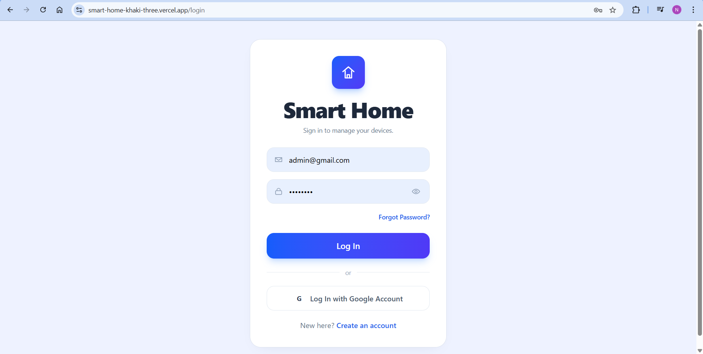
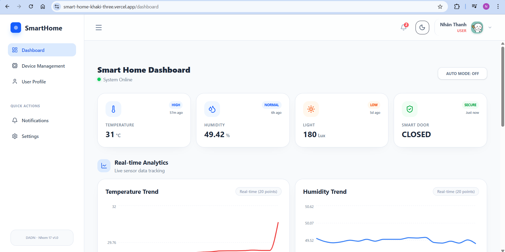
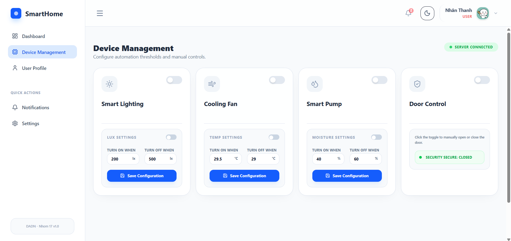
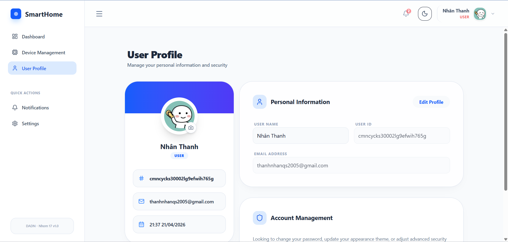
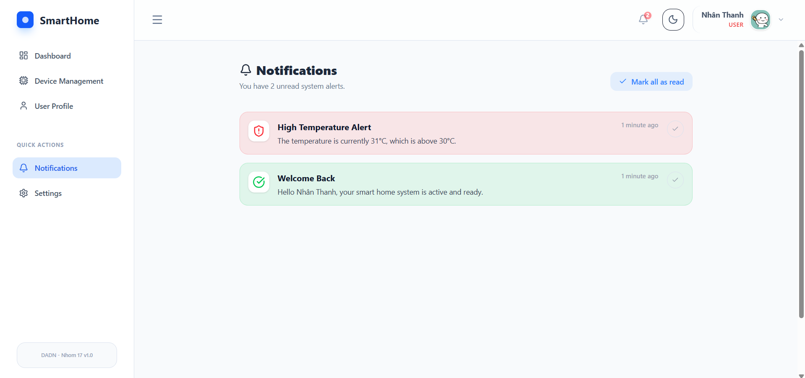
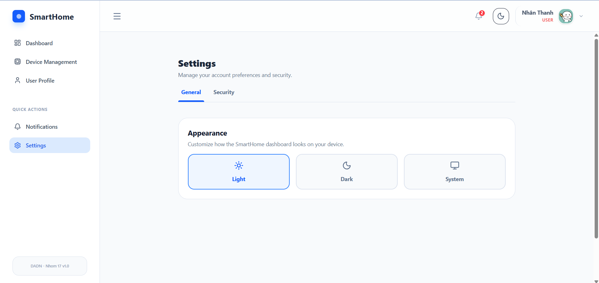

# Smart Home Dashboard

A modern, responsive smart home management dashboard built with Next.js (App Router), React, and Tailwind CSS. The system integrates secure authentication, real-time device tracking via MQTT, and a sleek user interface for monitoring sensors and toggling devices.

## 🚀 Technologies Used

- **Framework**: [Next.js 16](https://nextjs.org/) (App Router)
- **UI & Styling**: [Tailwind CSS v4](https://tailwindcss.com/), [Lucide React](https://lucide.dev/), [Recharts](https://recharts.org/), and [Sonner](https://sonner.emilkowal.ski/)
- **Authentication**: [Next-Auth (v5 / auth.js)](https://next-auth.js.org/) using Credentials & Bcrypt
- **Database Engine**: [MariaDB](https://mariadb.org/) managed by [Prisma ORM](https://www.prisma.io/)
- **IoT Communication**: [MQTT](https://mqtt.org/) for device status and control

## ✨ Features & Project State

- **Authentication System**: Fully implemented login and registration forms with validation. Protected routes redirect unauthenticated users securely.
- **Smart Dashboard**: Central overview interface with charts (via Recharts).
- **Device Management**: Components specific to adding, viewing, and toggling smart home devices.
- **User Profiles**: Manage user data inside the application securely.

## 🛠️ Getting Started

### 1. Environment Setup

Copy your environment variables and configure your database endpoint and NextAuth secrets.
```bash
cp .env.example .env
```

### 2. Database Preparation

Update your database schemas and generate Prisma client using:
```bash
npx prisma generate
npx prisma db push
```

### 3. Start Development Server

Run the development server to spin up the smart home frontend locally.

```bash
npm run dev
# or
yarn dev
# or
pnpm dev
# or
bun dev
```

Open [http://localhost:3000](http://localhost:3000) with your browser. You will be redirected to the `/login` page if you haven't authenticated yet.

## 📁 Project Structure

- `app/(auth)/`: Unprotected authentication routes (`/login`, `/register`).
- `app/(app)/`: Protected application routes (`/dashboard`, `/devices`, `/profile`).
- `app/api/`: Backend Next.js API routes (including NextAuth handlers).
- `components/`: Modular React components grouped by feature (`auth`, `dashboard`, `devices`, `layout`, `toggle`).
- `prisma/`: Database models and connection configurations.

## 📸 Interface Samples

Below are previews of the system in action:

### 1. Secure Authentication

*A sleek and responsive login interface supporting secure email/password credentials and OAuth Google Account sign-in.*

### 2. Live Dashboard Analytics

*A real-time overview displaying active live sensors (Temperature, Humidity, Light, Door Status) and dynamic charts updating via MQTT.*

### 3. Smart Device Management & Thresholds

*Individual device widgets allowing users to turn appliances on/off remotely, and set custom numerical thresholds for autonomous triggers.*

### 4. User Profile & Settings

*A centralized hub where users can view their account details, customize their avatars, and navigate to advanced security or theme settings.*

### 5. Global Notification System

*A dedicated inbox capturing real-time automated warnings and critical alerts based on user-defined appliance thresholds and environmental sensor limits.*

### 6. Settings

*A centralized hub where users change theme, password *